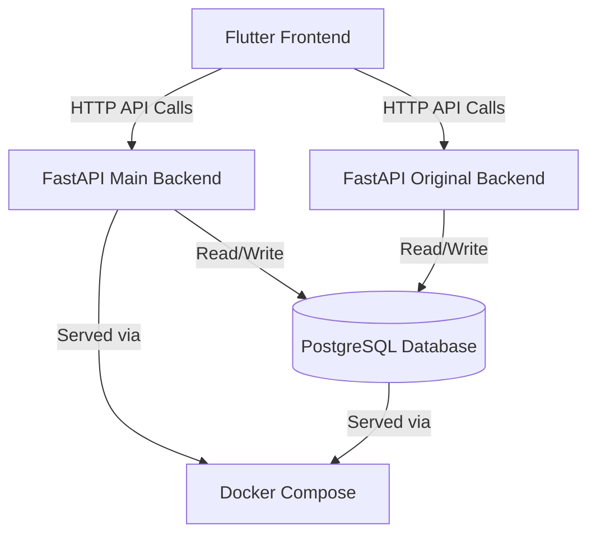

# System Architecture

## Overview

Our app is built using a client-server architecture. The flutter frontend communicates with the python backend using the FastAPI, which reads and writes data to our PostgreSQL database.

## Architecture Diagram

## Frontend

The frontend is built using flutter and dart, it's respnsibilities include:

- Collecting user input and sending it to the backend through API calls
- Managing navigation between different pages of the app
- Receiving and displaying data from the backend

## Backend

Our project contains two FastAPI backend services:

**Main Backend ('backend/main.py)** - The primary backend handling:
- User authentication 
- User profile and fitness questionnaire
- Workout saving and history
- Streak tracking
- Meal planning
- Weekly workout plans
- XP and level system
- Exercise library

**Original Backend ('flutter_app/python/app.py')** - Earlier version of the backend made to handle exercise filtering and workout saving.

## Database

Our app uses a PostgreSQL database to store all persistent data, including:

- Fitness data and goals
- Meal collection data
- Recipe data
- User account information
- Workout plans
- Workout guidance videos

## Docker

Our project uses Docker Compose to run the backend and database together. Keeping the setup and environmemt consistent for all team members.

## Data Flow Example

1. User logs a workout
2. Flutter sends API request to the backend
3. Backend validates the request and processes the logic
4. Backend queries the database to store data
5. Database returns the result to the backend 
6. Backend sends response to Flutter app
7. Flutter updates the UI to show the workout